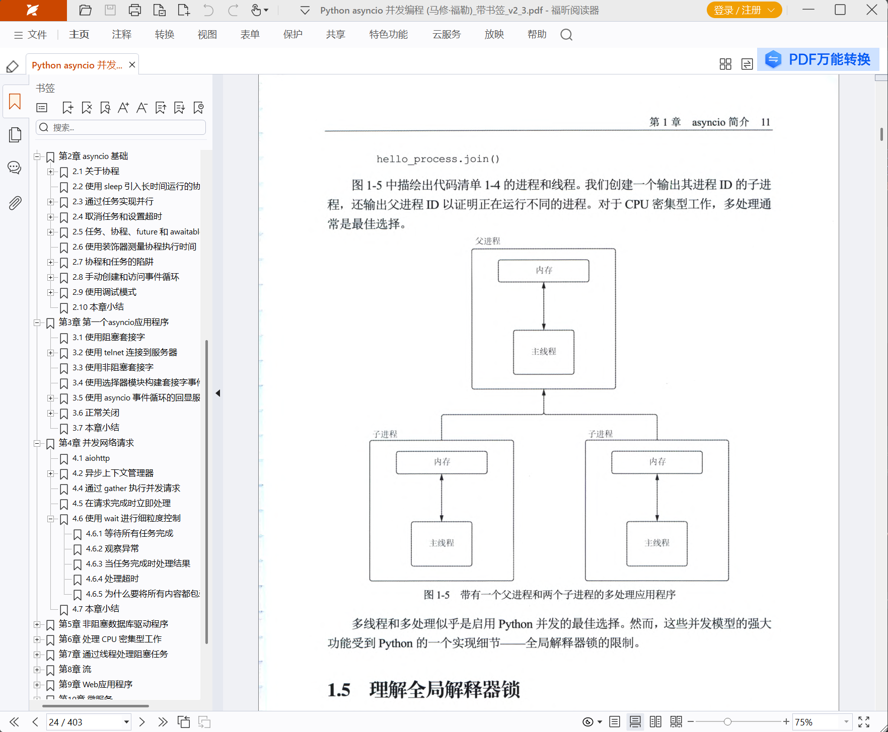

# simple pdf bookmark  

## 项目简介  
simple pdf bookmark是一个pdf书签生成工具，调用多模态大模型提取pdf页中的标题并且分级。

## 安装
### 1.创建conda环境  
建议使用conda安装。或者使用现有的python3.10以上版本也行。
```commandline
conda create -n simple_pdf_bookmark python=3.12
conda activate simple_pdf_bookmark
```

### 2.安装依赖  
cd到simple_pdf_trans项目目录下  
```commandline
pip install -r requirements.txt
```

### 3.配置模型
本项目自身要用的配置都在conf.yaml中，里面各项都做了详细说明。主要是需要配置一下大模型。
首先是配置vl_model，对应的就是如下这段配置：  
```yaml
vl_model: # 多模态大模型，提取标题
  openai_api_base: https://dashscope.aliyuncs.com/compatible-mode/v1
  model_name: qwen-vl-max-latest
  openai_api_key: sk-xxxxxxxxxxxxxxxxx
  timeout: 120
  cache_file_name: qwen_vl_cache # 缓存文件名，缓存文件夹为项目根目录下的cache目录
  streaming: false # 流式输出，没有强制要求流式输出的，可以指定为false
  temperature: 0
```
这是一个多模态大模型，我用的是阿里的，需要注册帐号并配置一个api key，把它填到openai_api_key这一项，参见[首次调用通义千问API](https://help.aliyun.com/zh/model-studio/first-api-call-to-qwen?spm=a2c4g.11186623.help-menu-2400256.d_0_0_1.111b65c5CoQn7d&scm=20140722.H_2840915._.OR_help-T_cn~zh-V_1)。  
模型我选的是qwen-vl-max-latest，对应model_name这一项，模型选择及计费等信息参见[视觉理解（Qwen-VL）](https://help.aliyun.com/zh/model-studio/vision?spm=a2c4g.11186623.help-menu-2400256.d_0_2_0.1fb92bdbJ4wQJB&scm=20140722.H_2845871._.OR_help-T_cn~zh-V_1)。  
当然也可以用其它厂商的模型，只要是兼容openai api的多模态模型都可以，本地vllm、ollama部署的也都ok，不过如果模型参数量比较小的话，可能性能有限。  
还有一个纯语言大模型llm_model，如下。  
```yaml
llm_model: # 语言大模型，判断vl_model返回的结果是不是"目录页"
  openai_api_base: https://api.deepseek.com/
  model_name: deepseek-chat
  openai_api_key: sk-xxxxxx
  timeout: 120
  cache_file_name: deepseek_chat_cache # 缓存文件名，缓存文件夹为项目根目录下的cache目录
  streaming: false # 流式输出，没有强制要求流式输出的，可以指定为false
  temperature: 0
```
这里我用的是deepseek的，还是一样，主要就是设置openai_api_key。不过这个模型并不是一定要配置的，具体参见如下配置：  
如果contents_judge_by_llm配置的是false，那就用不到这个模型。  
```yaml
bookmark:
  contents_page_thresh: 6 # 如果一页提取出的目录超过6个，则认为可能是目录页，交由llm_model判断是否是目录页，是则丢弃
  contents_judge_by_llm: false # 当触发contents_page_thresh时，如果此项为true，则由llm_model判断，否则直接判断是目录页。
```

## 生成书签
pdf路径为D:\学习\python\Python asyncio 并发编程 (马修·福勒).pdf，生成书签后的路径为D:\学习\python\Python asyncio 并发编程 (马修·福勒)_带书签.pdf  
则操作如下：
cd到simple_pdf_trans项目目录下，执行如下命令，如果路径中带空格，别忘了加双引号  
```commandline
python simple_bookmark.py "D:\学习\python\Python asyncio 并发编程 (马修·福勒).pdf" "D:\学习\python\Python asyncio 并发编程 (马修·福勒)_带书签.pdf"
```
效果如下：  
  

## 其它命令参数  
### --extra-prompt-path  
如果pdf内容格式比较复杂，可以自行添加额外的提示词，比如写到"D:\ai\simple_pdf_bookmark\膳食指南prompt.txt"里，内容如下：  
```text
a.三大部分为一级目录，并且注意"第X部分"可能跟它的具体标题不在同一行，请不要分成两个标题，比如"第一部分 一般人群膳食指南"是一个标题。
b.三大部分的起始页里除了一级标题(比如"第一部分 一般人群膳食指南")之外，还列出很多子标题，类似目录页，不要把它们当成标题。
c.第一部分中只有几大准则算作2级标题，其它的都不算。
d.第二部分中只有几种人群膳食指南为2级标题，其它的都不算。
e.第三部分中只有以中文数字加顿号开头的为2级标题，比如"一、xxx"，其它的都不算。
```
然后执行命令：  
```commandline
python simple_bookmark.py "D:\学习\营养学\中国居民膳食指南（2022）.pdf" "D:\学习\营养学\中国居民膳食指南（2022）_带书签.pdf" --extra-prompt-path D:\ai\simple_pdf_bookmark\膳食指南prompt.txt 
```
注意：  
- 1.该配置必须是utf-8编码  
- 2.提示词必须是跟模型的输入相关的，模型的输入是当前目录栈对应的图片、当前目录栈对应图片中的标题、以及当前要处理的图片。  

举个具体的例子，目录栈的意思就是比如当前已处理完的pdf页中最大级别的标题是"1.3.4 什么是多任务"，则目录栈即：
```text
1, "第1章 asyncio 简介"
2, "1.3 了解并发、并行和多任务处理"
3, "1.3.4 什么是多任务"
```
如上的1，2，3表示标题级别。当前正要处理的pdf页中的标题如下：  
```text
2, "1.4 了解进程、线程、多线程和多处理"
3, "1.4.1 进程"
```
我会把目录栈对应的几张图，以及这几张图中的标题作为提示词传给模型，目的是让模型能确定当前页中各标题的级别，并且让模型参照自己之前的答案，得出思路一致的答案。  
比如提示词里我会说，不要把页眉当标题，但是如果每次只传单张图片，可能有时还是会把页眉当标题（尽管我已经把温度设0了）。但加了目录栈的图片和答案后，“把页眉当标题”这件事情的概率就更低了。  
当然喽，这样也有坏处，那就是本来只调一张图，现在调多张图，需要花更多的时间和更多的钱。。。

**不过我解释这一段的重点在于，如果你的额外提示词是无法根据当前的模型输入进行判断的话，那就是无效的，甚至只有坏处。比如某本书的章有章号，
但章下的小节没有小节号，所以模型无法根据当前目录栈判断已经处理过多少小节了。然后你加的额外提示词是“某某章下面最多只能有10个小节”，那这就是无效提示词。**  
不过如果你又加了另外一个提示词“如果章下的小节没有小节号，请自行补上小节号”，那结合上一条提示词就可能有用了。所以关键是你要知道模型的输入到底是什么。  

### --skip-page-ranges  
可能有些pdf页会有些意想不到的问题，导致无法正确生成书签，可以设置此参数直接跳过那些页。从0开始算。必须是成对的，比如:0 2 表示跳过0-2页，0 2 7 8 表示跳过0-2，7-8，每一对都是前闭后闭的。  
比如现在想跳过第218到222页，还是用<<中国居民膳食指南（2022）>>的例子，则新增参数--skip-page-ranges 218 222 即可，完整如下：  
```commandline
python simple_bookmark.py "D:\学习\营养学\中国居民膳食指南（2022）.pdf" "D:\学习\营养学\中国居民膳食指南（2022）_带书签.pdf" --extra-prompt-path D:\ai\simple_pdf_bookmark\膳食指南prompt.txt 
 --skip-page-ranges 218 222 
```
注：之所以要跳过这几页，是因为这几页在讲喂母乳，讲的自然是具体的操作，然后阿里的模型直接返回400，说这是不适合的内容。。。